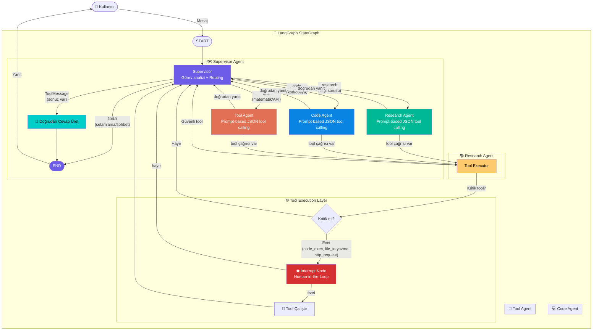
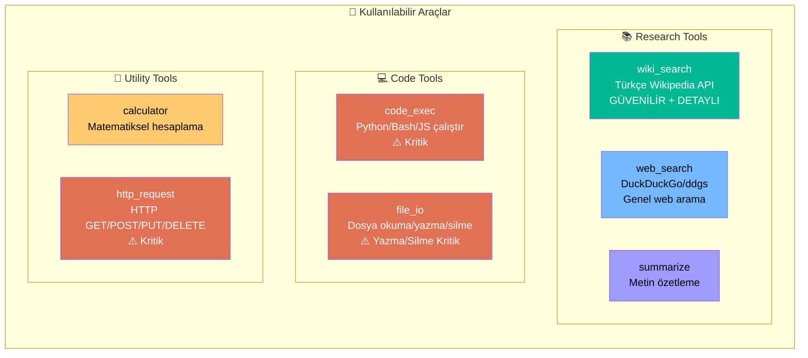
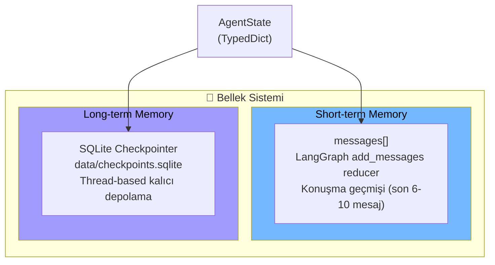

# Multi-Agent System with LangGraph + Turkish-Gemma-9b

Endüstriyel seviyede çoklu agent sistemi. **Local LLM** ile çalışır, **human-in-the-loop** onay mekanizmalı, **Türkçe** doğal dil destekli.

---

## 🏗️ Mimari Akış Diyagramı



---

## 🛠️ Araç Katmanı (Tools)



---

## 🧠 Bellek Katmanı



---

## 🤖 Model

| Özellik | Değer |
|---------|-------|
| Model | `ytu-ce-cosmos/Turkish-Gemma-9b-v0.1` |
| Kuantizasyon | 4-bit BitsAndBytes (NF4, double_quant) |
| compute_dtype | `torch.float16` |
| Framework | PyTorch + HuggingFace Transformers |
| VRAM Kullanımı | ~8 GB |

---

## 🚀 Kurulum

### Gereksinimler
- Python 3.10+
- CUDA destekli GPU (önerilen)
- 8 GB+ VRAM

### Adımlar

```bash
# 1. Repoyu klonla
git clone git@github.com:Fatih-Haslak/Agent.git
cd Agent

# 2. Conda env oluştur
conda create -n agent_env python=3.11
conda activate agent_env

# 3. Bağımlılıkları yükle
pip install -r requirements.txt

# 4. Çalıştır
# Terminal modu:
python src/main.py

# Web UI modu:
python src/ui.py
# Tarayıcıda: http://localhost:7860
```

---

## 📂 Proje Yapısı

```
src/
├── agents/
│   ├── supervisor.py       # 🗺️ Görev analizi + routing
│   ├── research.py         # 📚 Wikipedia + web arama
│   ├── code.py             # 💻 Kod yazma/çalıştırma
│   └── tool.py             # 🔧 Matematik + HTTP
├── tools/
│   ├── wiki_search.py      # 📚 Türkçe Wikipedia API
│   ├── web_search.py       # 🌐 DuckDuckGo/ddgs arama
│   ├── code_exec.py        # 💻 Kod çalıştırma
│   ├── file_io.py          # 📁 Dosya işlemleri
│   ├── calculator.py       # 🧮 Matematiksel hesaplama
│   ├── http_request.py     # 🌐 HTTP istekleri
│   └── executor.py         # ⚙️ Tool yürütücü + kritik kontrol
├── nodes/
│   ├── tools_node.py       # Tool çalıştırma
│   └── interrupt_node.py   # ⛔ Human-in-the-loop
├── memory/
│   ├── short_term.py       # In-state messages
│   └── long_term.py        # SQLite checkpointer
├── graph/
│   └── workflow.py         # LangGraph StateGraph
├── state/
│   └── agent_state.py      # TypedDict tanımı
├── config.py               # LLM yapılandırması
├── main.py                 # CLI entry point
└── ui.py                   # Gradio web arayüzü
```

---

## 🧪 Test Sonuçları

| Senaryo | Akış | Sonuç |
|---------|------|-------|
| **Selamlama** | SUPERVISOR → finish | "Merhaba! İyiyim, teşekkür ederim." ✅ |
| **Matematik** | SUPERVISOR → TOOL → TOOLS → SUPERVISOR | "15 × 23 = 345" ✅ |
| **Wikipedia** | SUPERVISOR → RESEARCH → TOOLS → SUPERVISOR | "Sergen Yalçın, 5 Kasım 1972 doğumlu..." ✅ |

---

## ⚠️ Human-in-the-Loop

Kritik tool'lar öncesi onay ister:
- `code_exec` (kod çalıştırma)
- `file_io` yazma/silme (okuma güvenli)
- `http_request` (harici API çağrısı)

---

## GitHub

Remote: `git@github.com:Fatih-Haslak/Agent.git`
