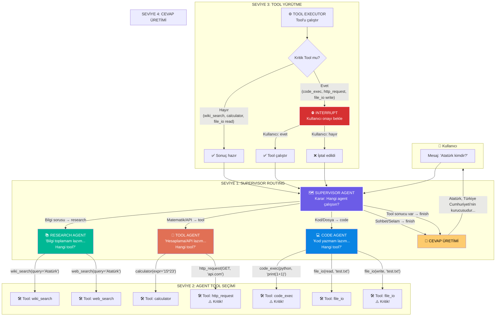
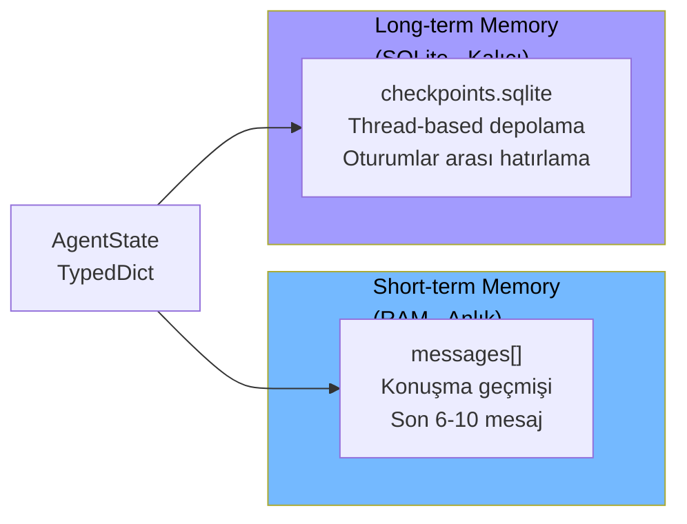

# Multi-Agent System with LangGraph + Turkish-Gemma-9b

Endüstriyel seviyede çoklu agent sistemi. **Local LLM** ile çalışır, **human-in-the-loop** onay mekanizmalı, **Türkçe** doğal dil destekli.

---

## 🎯 Kim Ne Kararını Veriyor?

| Katman | Kim | Karar |
|--------|-----|-------|
| **1. Routing** | 🗺️ **Supervisor** | "Bu görev hangi agent'a gitsin?" (research / code / tool / finish) |
| **2. Tool Seçimi** | 📚💻🔧 **Alt Agent** | "Bu görevi hangi tool ile yapayım?" (wiki_search / calculator / code_exec ...) |
| **3. Tool Çalıştırma** | ⚙️ **Tool Executor** | "Bu tool kritik mi? → Onay gerekli mi?" |
| **4. Cevap Üretimi** | 🗺️ **Supervisor** | "Tool sonucu var → Direkt cevap ver" veya "Tekrar routing yap" |

---

## 🏗️ DETAYLI MİMARİ AKIŞI



---

## 🔍 KARAR MEKANİZMASI DETAYLI AÇIKLAMA

### 1️⃣ Supervisor Nasıl Routing Kararı Verir?

```
Kullanıcı: "Atatürk kimdir?"
    ↓
Supervisor LLM (Turkish-Gemma-9b)
Prompt: "Bu görev hangi agent'a gitsin?"
    ↓
Çıktı: {"next": "research", "reason": "Bilgi sorusu"}
    ↓
Karar: RESEARCH agent'ına gönder
```

### 2️⃣ Research Agent Nasıl Tool Seçer?

```
Research Agent LLM (Turkish-Gemma-9b)
Prompt: "Sergen Yalçın kimdir? Araştırma yap."
    ↓
Çıktı: {"tool": "wiki_search", "args": {"query": "Sergen Yalçın"}}
    ↓
Karar: wiki_search tool'unu çağır
```

### 3️⃣ Tool Executor Nasıl Çalışır?

```
wiki_search(query="Sergen Yalçın")
    ↓
Kritik mi? → Hayır (güvenli tool)
    ↓
Direkt çalıştır
    ↓
Sonuç: "Sergen Yalçın, 5 Kasım 1972 doğumlu..."
    ↓
Supervisor'a dön
```

### 4️⃣ Supervisor Sonucu Nasıl Değerlendirir?

```
Supervisor: "Tool sonucu var mı?"
    ↓
Evet → "Direkt cevap üret, tekrar agent'a gönderme"
    ↓
LLM: "Sergen Yalçın, Türk teknik direktör..."
    ↓
Kullanıcıya yanıt
```

---

## 🛠️ TOOL KATMANI

| Tool | Kim Seçer | Kritik? | Örnek Kullanım |
|------|-----------|---------|----------------|
| `wiki_search` | 📚 Research Agent | ❌ | `"Atatürk kimdir"` → Wikipedia'dan detaylı bilgi |
| `web_search` | 📚 Research Agent | ❌ | `"Son dakika haberler"` → Web araması |
| `summarize` | 📚 Research Agent | ❌ | Uzun metni özetleme |
| `calculator` | 🔧 Tool Agent | ❌ | `"15 * 23"` → 345 |
| `http_request` | 🔧 Tool Agent | ⚠️ **Evet** | `"GET https://api.com"` → Onay gerektirir |
| `code_exec` | 💻 Code Agent | ⚠️ **Evet** | `"python: print(1+1)"` → Onay gerektirir |
| `file_io` (read) | 💻 Code Agent | ❌ | `"read test.txt"` → Güvenli |
| `file_io` (write) | 💻 Code Agent | ⚠️ **Evet** | `"write test.txt"` → Onay gerektirir |

---

## 🧠 BELLEK KATMANI



---

## 🤖 MODEL

| Özellik | Değer |
|---------|-------|
| Model | `ytu-ce-cosmos/Turkish-Gemma-9b-v0.1` |
| Kuantizasyon | 4-bit BitsAndBytes (NF4, double_quant) |
| compute_dtype | `torch.float16` |
| Framework | PyTorch + HuggingFace Transformers |
| VRAM Kullanımı | ~8 GB |

---

## 🚀 KURULUM

### Gereksinimler
- Python 3.10+
- CUDA destekli GPU (önerilen)
- 8 GB+ VRAM

### Adımlar

```bash
# 1. Repoyu klonla
git clone git@github.com:Fatih-Haslak/Agent.git
cd Agent

# 2. Conda env oluştur
conda create -n agent_env python=3.11
conda activate agent_env

# 3. Bağımlılıkları yükle
pip install -r requirements.txt

# 4. Çalıştır
# Terminal modu:
python src/main.py

# Web UI modu:
python src/ui.py
# Tarayıcıda: http://localhost:7861
```

---

## 📂 PROJE YAPISI

```
src/
├── agents/
│   ├── supervisor.py       # 🗺️ ROUTING: Hangi agent'a gitsin?
│   ├── research.py         # 📚 TOOL SEÇİMİ: wiki_search/web_search?
│   ├── code.py             # 💻 TOOL SEÇİMİ: code_exec/file_io?
│   └── tool.py             # 🔧 TOOL SEÇİMİ: calculator/http_request?
├── tools/
│   ├── wiki_search.py      # 📚 Türkçe Wikipedia API
│   ├── web_search.py       # 🌐 DuckDuckGo/ddgs arama
│   ├── code_exec.py        # 💻 Kod çalıştırma
│   ├── file_io.py          # 📁 Dosya işlemleri
│   ├── calculator.py       # 🧮 Matematiksel hesaplama
│   ├── http_request.py     # 🌐 HTTP istekleri
│   └── executor.py         # ⚙️ TOOL YÜRÜTÜCÜ + Kritik kontrol
├── nodes/
│   ├── tools_node.py       # Tool çalıştırma
│   └── interrupt_node.py   # ⛔ Human-in-the-loop onay
├── memory/
│   ├── short_term.py       # In-state messages
│   └── long_term.py        # SQLite checkpointer
├── graph/
│   └── workflow.py         # LangGraph StateGraph
├── state/
│   └── agent_state.py      # TypedDict tanımı
├── config.py               # LLM yapılandırması
├── main.py                 # CLI entry point
└── ui.py                   # Gradio web arayüzü (port 7861)
```

---

## 🧪 DOĞRULANAN TEST SONUÇLARI

| Senaryo | Supervisor Kararı | Agent Tool Seçimi | Sonuç |
|---------|-------------------|-------------------|-------|
| **"Merhaba"** | `finish` (sohbet) | — | "Merhaba! İyiyim..." ✅ |
| **"15×23?"** | `tool` (matematik) | `calculator` | "345" ✅ |
| **"Sergen Yalçın?"** | `research` (bilgi) | `wiki_search` | "5 Kasım 1972 doğumlu..." ✅ |

---

## ⚠️ HUMAN-IN-THE-LOOP

**Kritik tool'lar öncesi onay ister:**
- `code_exec` (kod çalıştırma)
- `file_io` yazma/silme (okuma güvenli)
- `http_request` (harici API çağrısı)

---

## GitHub

Remote: `git@github.com:Fatih-Haslak/Agent.git`
